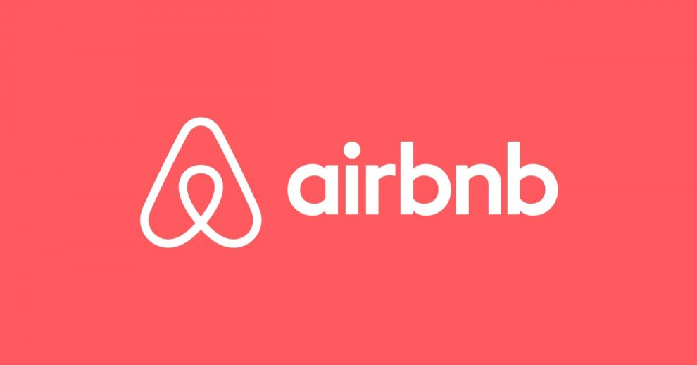
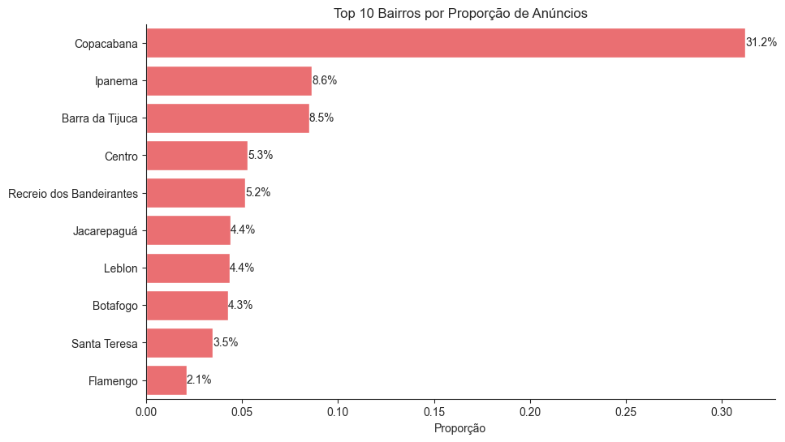
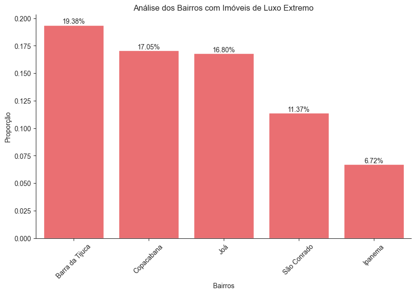
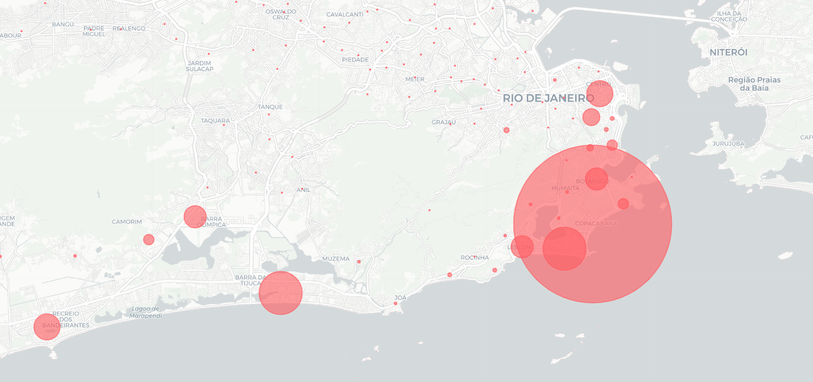
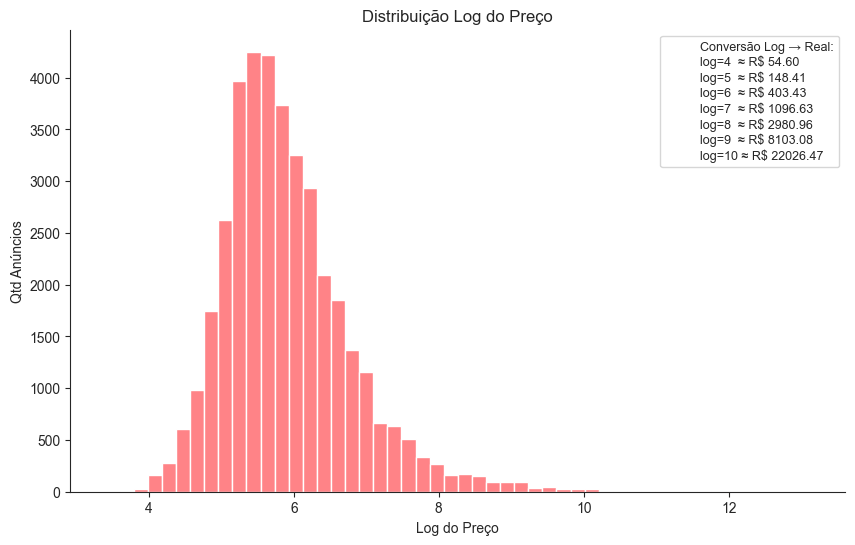
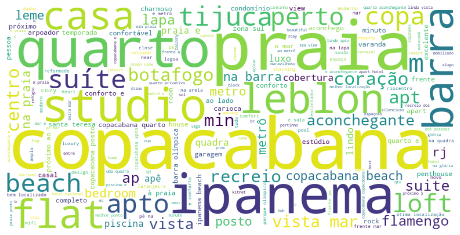
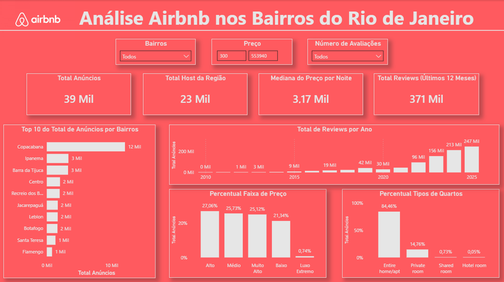

# Análise Exploratória --- Airbnb Bairros do Rio de Janeiro

## Contexto

Este projeto apresenta uma análise exploratória dos dados públicos do
Inside Airbnb referentes à cidade do Rio de Janeiro. O objetivo foi
compreender o comportamento dos preços, a distribuição geográfica dos
anúncios e identificar padrões relevantes no mercado de locação por
temporada.

A base inclui informações como preço por noite, tipo de acomodação,
bairro, número de avaliações, disponibilidade ao longo do ano e
quantidade de anúncios por anfitrião.

------------------------------------------------------------------------

## Tratamento dos Dados

Antes das análises, foi realizada uma etapa de limpeza e padronização:

-   Remoção de colunas totalmente vazias.
-   Exclusão de registros com ausência de `host_name`, devido à baixa
    representatividade.
-   Remoção de aproximadamente 10% da base por ausência de preço.
-   Definição de um teto analítico de R\$60.000 para reduzir o impacto
    de outliers extremos.

A variável preço apresentou forte assimetria à direita, com valores
muito elevados. Após aplicação de transformação logarítmica, observou-se
comportamento próximo do normal, indicando um padrão log-normal ---
comum em mercados imobiliários.

------------------------------------------------------------------------

## Principais Insights

### 1. O Mercado por Bairros e de Luxo Extremo
A maior concentração de anúncios está em Copacabana, seguida por Ipanema
e Barra da Tijuca. Quando analisamos apenas os imóveis na faixa mais
alta de preço (percentil 99--100%), bairros como Barra da Tijuca, Copacabana, Joá, São Conrado e Ipanema ganham maior relevância. 
Para vizualizar o mapa interativo dos bairros com mais anúncios ele esta nomeado como "mapa_frequencia_bairros.html"

   
 

### 2. Tipos de imóveis
Cerca de 80% dos anúncios são de imóveis inteiros (casas ou
apartamentos), enquanto quartos privados representam a maior parte do
restante.

 

### 3. Comportamento Log-Normal de Preços
O mercado imobiliário raramente é linear. Ao aplicar a transformação logarítmica, identifiquei que o "coração" do mercado do Rio pulsa entre R$ 148,00 e R$ 403,00 por noite.

 

### 4. Correlação Entre as Variáveis
A análise de correlação mostrou relação forte entre número total de
avaliações, avaliações por mês e avaliações nos últimos 12 meses, como
esperado. Não foram identificadas correlações relevantes entre preço e
variáveis operacionais.

 

### 5. Análise Textual dos Anúncios
Através do processamento de texto (NLP básico), ficou claro que o marketing dos anúncios foca no estilo de vida:

Palavras como "Vista", "Posto", "Beach" e "Próximo" são os principais gatilhos de vendas.
O Leblon, apesar de ser o 7º em volume de anúncios, é um dos termos mais citados, funcionando como um "selo de qualidade" mesmo em anúncios de bairros vizinhos.

 

------------------------------------------------------------------------

## Dashboard Power BI

Pelo Dashboard é possível observar valores de  **Total de Anúncios**, **Mediana do Preço por Noite**, **Total Reviews** e gráficos com informações sobre o **Top 10 de Bairros Mais Anúnciados**, **Total de Reviews por Ano**, **Percentual das Faixas de Preço** e o **Percentual de Quartos Anúnciados**.

 

------------------------------------------------------------------------

## Conclusão

O mercado de Airbnb no Rio de Janeiro apresenta forte concentração em
áreas turísticas, alta variação de preços e padrão de distribuição
compatível com mercados imobiliários. A localização permanece como
principal determinante estratégico na formação de valor dos anúncios.

------------------------------------------------------------------------

**Fonte dos dados:** https://insideairbnb.com/

